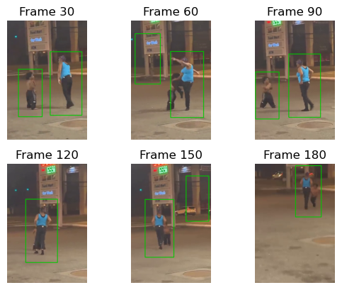
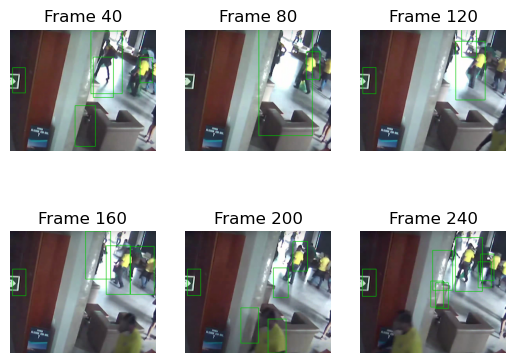
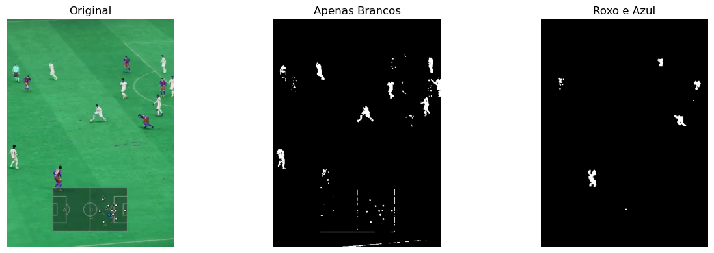
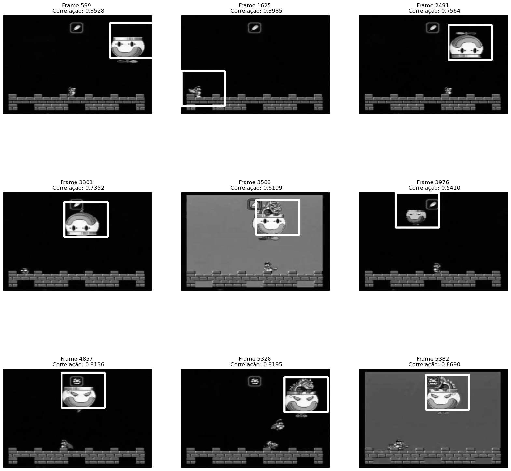
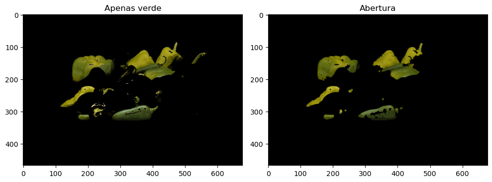

# visao_computacional
Códigos da Disciplina de Visão Computacional ministradas pelo prof. Marcos Laia. 
Segmentação e reconhecimento. 

## Prática 4 - Reconhecendo pessoas por SVM

## Prática 3 - Kmeans para tracking de jogadores

## Prática 2

## Prática 1

